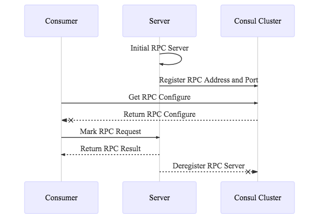
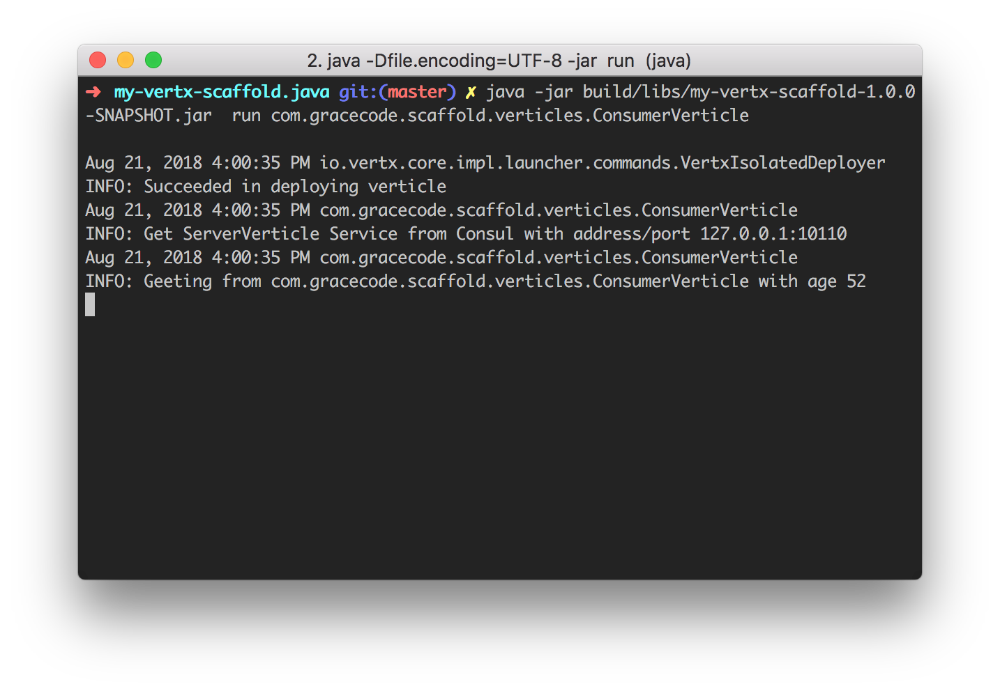

# 基于 Vert.x 的简单脚手架

[](https://travis-ci.org/feelinglucky/my-vertx-scaffold.java)

在搭建微服务的过程中，免不了会使用多个技术栈融合以及选型，这是个比较漫长的过程。架构应该更关注于业务的本身，同时又没有时间去关注过多的技术细节，所以就会有脚手架这东西。

其实可能您也第一反应，在这种情况下会使用 [Spring Boot](https://spring.io/projects/spring-boot) ，它是个非常流行的框架，同时作为架构的 Startup 也是个非常不错的开始。

搭建这个脚手架的初心，就是想了解下其他不同的技术栈。`Vert.x` 相对于 `Spring` 而言在国内远没有后者流行（其实 `Vert.x` 也不认为自己是个 framwork，只是个 toolkit），但在使用过程中非常的顺心。

因此，还是推荐给大家可以作为备选项目的一个新的尝试。


## 框架技术栈

基本的服务和类库使用到了如下：

1. [Consul](https://www.consul.io/)
2. [Vert.x](https://vertx.io/)
3. [gRPC](https://grpc.io/)
4. [Dagger2](https://github.com/google/dagger)
5. [Reactive Java](https://reactivex.io)

其中，Consul 用作服务发现以及配置统一，每个 Vert.x 的 `BaseVerticle` 都扩展了使用 Consul 服务发现的能力，同时 gRPC 用作节点之间的 RPC 通讯。



在本脚手架的例子中，分别使用了两个 Verticle 支撑了三者的链路关系。`ServerVerticle` 实现了 RPC 的服务端，同时广播给 Consul 对应自己的地址和端口。`ConsumerVerticle` 从 Consul 获得 `ServerVerticle` 注册 RPC 服务并调用输出。

## 使用说明

环境方面请先在本机启动 Consul 服务，或者修改对应的配置地址和端口。构建使用 gradle 直接 build 即可，具体参见 `gradle tasks` 命令。

### 配置

配置文件在 `src` 的 `resources` 目录中，使用 JSON 格式管理，脚手架中使用 `application.json` 全局定义了响应的配置，其中主要定义了 Consul 端以及 RPC 的地址信息。

注意，默认 `Verticle` 不读取响应的配置，对应的配置目前在 `Launcher` 中获取以及重载。

### 运行

使用 `gradle jar` 构建 JAR 包，然后依次运行启动 Server 端以及 Consumer 端的两个 Verticle。

推荐使用 `Launcher` 启动 `Verticle`，因为它可以除了加载配置以外，还可以做额外的初始化操作，这里脚手架已经简单的封装好了，直接使用即可。

详细的配置信息，可以参考 `gradle.build` 中的相关配置。

```
java -jar build/libs/my-vertx-scaffold-1.0.0-SNAPSHOT.jar \
    run com.gracecode.scaffold.verticle.ServerVerticle

java -jar build/libs/my-vertx-scaffold-1.0.0-SNAPSHOT.jar  \
    run com.gracecode.scaffold.verticle.ConsumerVerticle
```



当看见 `Consumer` 端显示正确的返回 RPC 信息，则说明这个脚手架可以使用了。

### 测试

测试框架选型使用了 [Spock](http://spockframework.org/)，它是个基于 Goovy 的优雅的测试框架。由于 Vert.x 每个 Verticle 想对独立的特性，因此测试很方便。

在 `DeployVerticleSpec.groovy` 可以看到如何使用 Spock 进行 Vert.x 部署以及下线 Verticle 的测试。


## 技术选型思路

### Why Vert.x & Reactive

Vert.x 是个很好的异步调用库，同时也非常适合在微服务中使用。相比传统的 Spring 框架，它的主要优点是在于多语言支持和异步调用（虽然 Spring 也有对应的 WebFlux）。配合 Reactive Java，在 Vert.x 中能够写出很简单清晰的代码。

### Why Grpc

Vert.x 和 Grpc 的配合能够夸平台以及多语言开发使用，对于不同背景的技术团队能够很好的配合以及提高开发效率（但同比学习曲线想对比较高）。

### Why Dagger2

 对比 Spring 的 Ioc，Dagger2 有着更好的性能优势，同时也弥补了 Vert.x 在 Ioc 这块的短板。

 Vert.x 中 Verticle 的 Context 以及生命周期想对比较简单，因此配合 Dagger2 使用注入更为方便和简洁。
